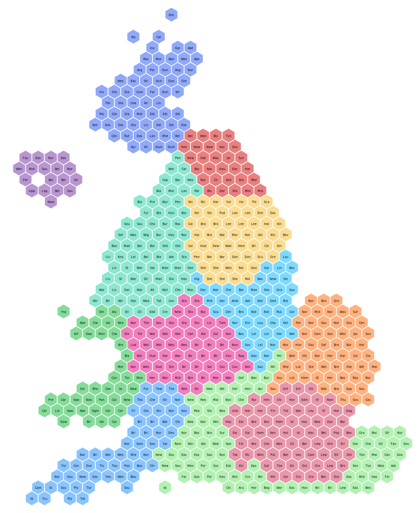

# hexmap
Hex maps for ICS using Simple Features

A markdown file and necessary csv files to build hexmpas of ICS. 

A bit of a dump I am afraid  - need to tidy it up.

# What is the purpose of this blog? 

I am going to introduce how to use Simple Features to look at creating bespoke maps using co-ordinate system grids. 

# What is the problem? 

It all started with trying to do a map of ICS to show variation but being flummoxed by the different size of each of them. London is always swamped or has to be mapped seperately, and North East always draws the eye as it is so big.

\centering
{width="100%"}

# So what can we do?  Hexmapping

One approached used to address such variation is to use a hex map. Hex maps have become the standard when visualizing data where the sizing of the geographical region is unimportant. It is not new, here is an example from 1895, The Unification of London: The Need and the Remedy. (https://mappinglondon.co.uk/2013/hexagonal-map-of-london/)

Here is an example using UK constituencies <https://open-innovations.org/projects/hexmaps/constituencies/>.  As you can see visual wieght of Scotland has shrunk whist the more populous London takes up more space, but the map retains traces of the orignal geography, unlike a bar chart. Or visit this dynamic example of regular to hex geography by ONS https://www.ons.gov.uk/visualisations/nesscontent/dvc237/hex.html.

{width="50%"}
  
### Why hexagons? 

Hexagons are a good shape to work with as the distances between its points are regular due to its internal symmetry.

There are two orientations you can use pointed or flat tops. Basically rotate the hexagon by 90degrees. Pointed-top hexes take up more vertical room, so can be better for portrait orientation.The choice is yours depending on your aesthetics. You can learn more about hexagon geomtery at https://hexnet.org/content/hexagonal-geometry.

 

{width="50%"}
  
## Mapping the ICS geography

There are no tools to build hex maps from shapefiles. So you have to get out paper and pencil/ipad/hex stickers and a wall to map out the relative positions of the objects you want to map. I used a hex paper image and ipad. One free resource for printing hex paper is https://incompetech.com/graphpaper/hexagonal/ . 

There is no science to this, it really is what works best for the geography you are working with.  This is an example of my rough working where to put STP/ICS.   
   
    

{width="50%"}
      
      The co-ordinates are kept quite simple by setting the width and height to be 4 units. Then using the row and column positions (starting from the origin - bottom left) to build the co-ordinates. So in my mapping Cornwall is in row 1 and column 1, and so on.  

The end result of all this plotting is a table of with a row for every hex and 7 not 6 points, you have to complete the shape.

     

{width="50%"}     
      
