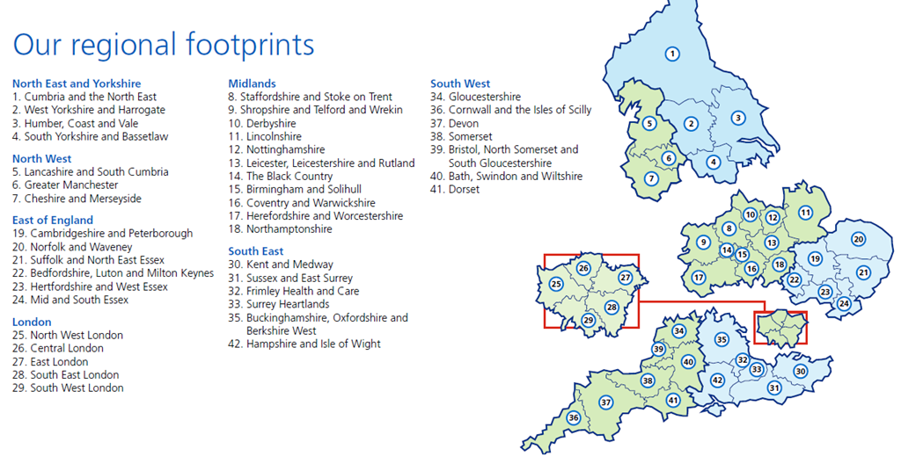
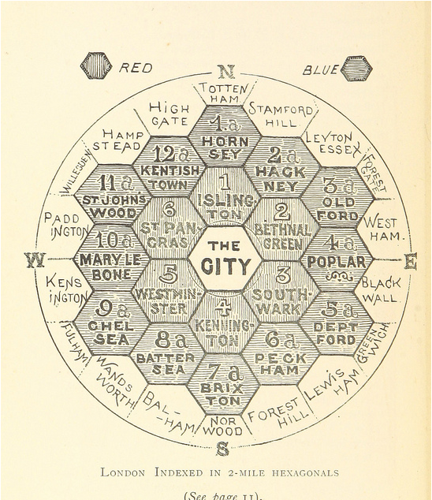
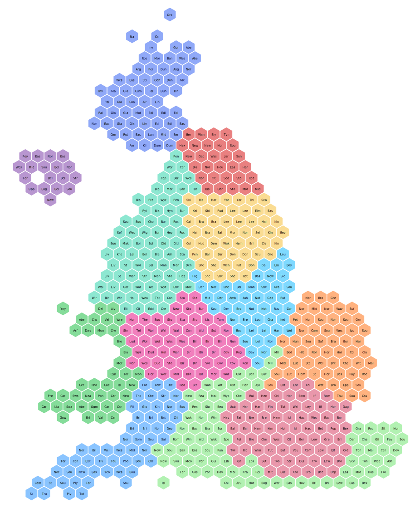
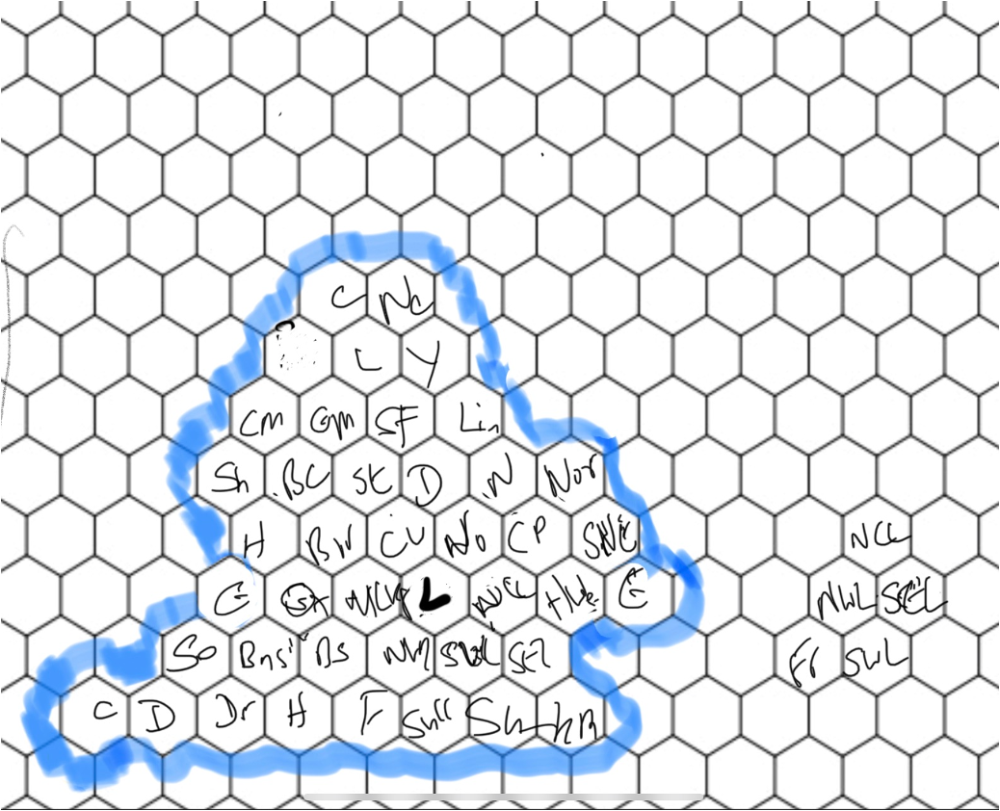
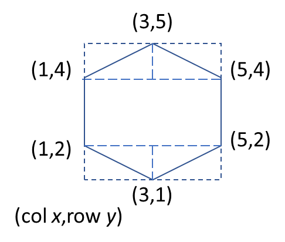
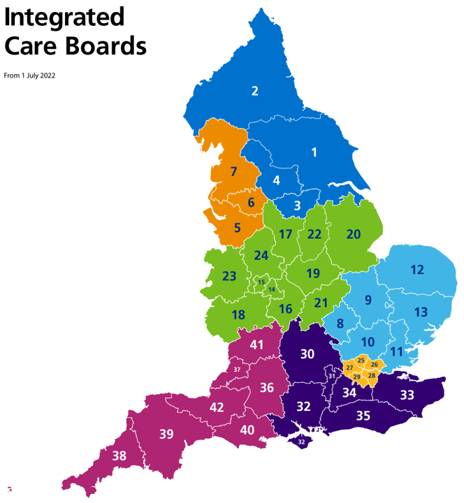
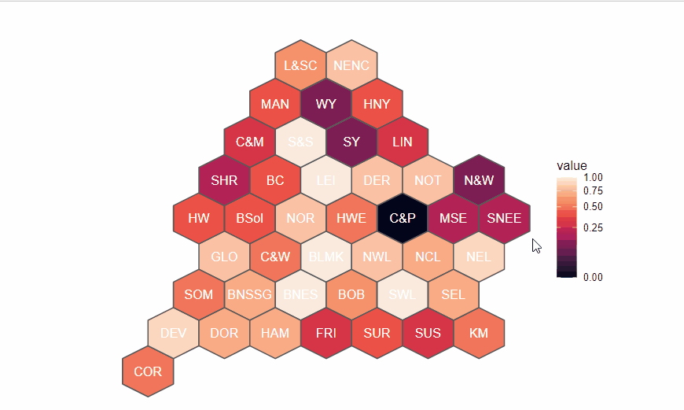
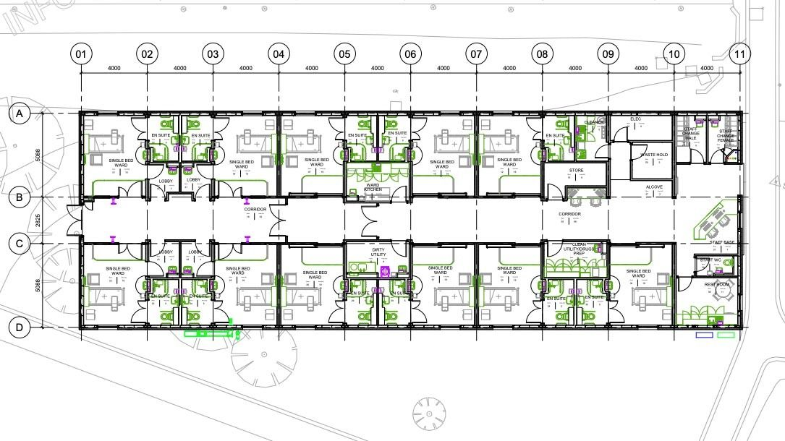
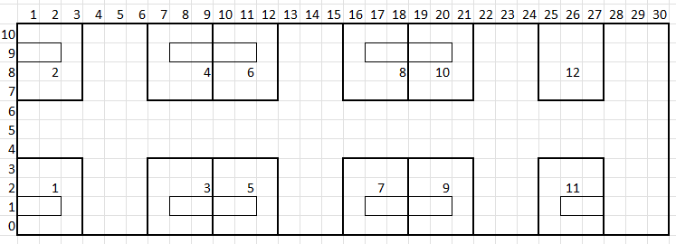

```{r setup, include = FALSE}
knitr::opts_chunk$set(
  comment = "#>", echo = FALSE, warning = FALSE, message = FALSE, include = TRUE
)
```

# What is the purpose of this blog? 

I am going to introduce how to use Simple Features to look at creating bespoke maps using co-ordinate system grids. 


# What is the problem? 

It all started with trying to do a map of ICS to show variation but being flummoxed by the different size of each of them. London is always swamped or has to be mapped seperately, and North East always draws the eye as it is so big.

\centering
{width="100%"}

# So what can we do?  Hexmapping

```{r}

#set up columns in markdown using CSS Grid Layout

#https://developer.mozilla.org/en-US/docs/Web/CSS/grid-template-columns
```

:::: {style="display: grid; grid-template-columns: 1fr 200px; grid-column-gap: 10px; "}

::: {}


One approached used to address such variation is to use a hex map. Hex maps have become the standard when visualizing data where the sizing of the geographical region is unimportant. It is not new, here is an example from 1895, The Unification of London: The Need and the Remedy. (https://mappinglondon.co.uk/2013/hexagonal-map-of-london/)

:::

::: {}

```{r, out.width = "200px", fig.cap = "Unified Map of London"}

```

:::

::::

Here is an example using UK constituencies <https://open-innovations.org/projects/hexmaps/constituencies/>.  As you can see visual wieght of Scotland has shrunk whist the more populous London takes up more space, but the map retains traces of the orignal geography, unlike a bar chart. Or visit this dynamic example of regular to hex geography by ONS https://www.ons.gov.uk/visualisations/nesscontent/dvc237/hex.html.

<div style="text-align: center;">
{width="50%"}
</div>

### Why hexagons? 

:::: {style="display: grid; grid-template-columns: 1fr 120px; grid-column-gap: 10px; "}

::: {}

Hexagons are a good shape to work with as the distances between its points are regular due to its internal symmetry.

There are two orientations you can use pointed or flat tops. Basically rotate the hexagon by 90degrees. Pointed-top hexes take up more vertical room, so can be better for portrait orientation.The choice is yours depending on your aesthetics. You can learn more about hexagon geomtery at https://hexnet.org/content/hexagonal-geometry.
:::

::: {}

```{r, fig.align = "right", out.width = "150px", fig.cap = "Heaxgon geometry"}
knitr::include_graphics("hexgeomRW.png")
```

:::

::::

## Mapping the ICS geography

:::: {style="display: grid; grid-template-columns: 1fr 400px; grid-column-gap: 10px; "}

::: {}

There are no tools to build hex maps from shapefiles. So you have to get out paper and pencil/ipad/hex stickers and a wall to map out the relative positions of the objects you want to map. I used a hex paper image and ipad. One free resource for printing hex paper is https://incompetech.com/graphpaper/hexagonal/ . 

There is no science to this, it really is what works best for the geography you are working with.  This is an example of my rough working where to put STP/ICS. 

:::

::: {}

```{r, fig.align = "center", out.width = "400px", fig.cap = "Heaxgon geometry"}

```
:::

::::

:::: {style="display: grid; grid-template-columns: 1fr 200px; grid-column-gap: 10px; "}

::: {}

The co-ordinates are kept quite simple by setting the width and height to be 4 units. Then using the row and column positions (starting from the origin - bottom left) to build the co-ordinates. So in my mapping Cornwall is in row 1 and column 1, and so on.  

The end result of all this plotting is a table of with a row for every hex and 7 not 6 points, you have to complete the shape.

:::

::: {}

```{r, fig.align = "center", out.width = "200px", fig.cap = "Heaxgon geometry"}

```

:::

::::

```{r ics polygons, results = "asis", echo = TRUE}

library(tidyverse)
library(knitr)
library(kableExtra)

#https://www.england.nhs.uk/integratedcare/integrated-care-in-your-area/

ics <- read_csv("ics_coords2.csv")


ics$x1 <- ics$col
ics$x2 <- ics$x1
ics$x3 <- ics$x2 + 2
ics$x4 <- ics$x3 + 2
ics$x5 <- ics$x4
ics$x6 <- ics$x5 - 2
ics$x7 <- ics$x1

ics$y1 <- ics$row * 3 - 2
ics$y2 <- ics$y1 + 2
ics$y3 <- ics$y2 + 1
ics$y4 <- ics$y2
ics$y5 <- ics$y1
ics$y6 <- ics$y5 - 1
ics$y7 <- ics$y1


ics[1:5, c(1:4, 12:25)] %>%
  arrange(row, col) %>%
  kbl(caption = "ICS geometery") %>%
  kable_styling()

```


## SF workflow

<https://r-spatial.github.io/sf/index.html>

The key to creating polygons is that the coordinates have to be in sequence to form a closed area (i.e., the last point is the same as the first point).

So your data will need a bit of manipulation to create the coordinates, and put them in order. I ran into difficulties with this and used this solution. (<https://stackoverflow.com/questions/63566637/rror-in-funxi-is-numericx-is-not-true-when-using-st-polygon>)

There are three steps to creating a SF

-   st_polygon() - Create simple feature from a numeric vector, matrix or list

-   st_sfc() - Create simple feature geometry list column

-   st_sf() - Create sf object

Merge a Spatial object having a data.frame (i.e. merging of non-spatial attributes).

sp::merge is located in package sp. Please install and load package sp before us

```{r data entry, echo=TRUE}

library(sf)  #simple features
library(sp)  #simple features

#https://stackoverflow.com/questions/63566637/rror-in-funxi-is-numericx-is-not-true-when-using-st-polygon
class(ics) <- "data.frame"

icsdata <- read_csv("ics_data.csv")

#https://stackoverflow.com/questions/44335246/polygons-from-coordinates
lst <- lapply(1 : nrow(ics), function(x) {
  ## create a matrix of coordinates that also "close" the polygon
  res <- matrix(c(ics[x, "x1"], ics[x, "y1"],
                  ics[x, "x2"], ics[x, "y2"],
                  ics[x, "x3"], ics[x, "y3"],
                  ics[x, "x4"], ics[x, "y4"],
                  ics[x, "x5"], ics[x, "y5"],
                  ics[x, "x6"], ics[x, "y6"],
                  ics[x, "x7"], ics[x, "y7"])  ## need to close the polygon
                , ncol = 2, byrow = T
  )
  ## create polygon objects
  st_polygon(list(res))
})

## st_sfc : creates simple features collection
## st_sf : creates simple feature object
sfdf <- st_sf(ICS22NM = ics[, "ICS22NM"], st_sfc(lst))

#merge SF object to ics data frame and the centroids of the hexagon for the labels

ics_map <- sp::merge(sfdf, ics) %>%
  mutate(labelX = map_dbl(geometry, ~st_centroid(.x)[[1]]),
         labelY = map_dbl(geometry, ~st_centroid(.x)[[2]]))

icsdata <- icsdata %>%
  mutate(value = round(value, 1))
```

#### Plotting the map

ggplot2() contains a geom for simple feature objects, geom_sf_data().

There is a geom_sf_label, but I think geom_text() is better.

```{r produce map, fig.align = "center", echo=TRUE}
#Join the data we want to map
ics_map <- ics_map %>%
  left_join(icsdata)

ggplot() +
   geom_sf(data = ics_map, aes(fill = NHSER21NMSHT)) +
  geom_sf_label(data = ics_map, aes(label = NHSER21NMSHT),
  label.padding = unit(0.1, "lines")) +
  labs(fill = "Region") +
    scale_fill_manual(values = c("NW" = "#ed8b00",
                                "NEY" = "#0072ce",
                                "Mid" = "#78be20",
                                "EoE" = "#41b6e6",
                                "SW" = "#ae2573",
                                "SE" = "#330072",
                                "LDN" = "#ffb81c")) +
  theme_void()

```
Using geom_text(), I think it looks better, and the final map looks similar to the starting position

```{r produce map2, echo = TRUE}
#using geom_text

icsplot <- ggplot() +
   geom_sf(data = ics_map, aes(fill = NHSER21NMSHT)) +
geom_text(data = ics_map, aes(x = labelX,
                              y = labelY,
                              label = NHSER21NMSHT),
                              colour = "white") +
  labs(fill = "Region") +
    scale_fill_manual(values = c("NW" = "#ed8b00",
                                "NEY" = "#0072ce",
                                "Mid" = "#78be20",
                                "EoE" = "#41b6e6",
                                "SW" = "#ae2573",
                                "SE" = "#330072",
                                "LDN" = "#ffb81c")) +
  theme_void()

```

:::: {style="display: grid; grid-template-columns: 1fr 1fr; grid-column-gap: 10px; "}

::: {}


```{r, fig.cap = "Using geom_text() to identify hexes"}

icsplot

```

:::

::: {}


```{r, fig.cap = "Actual ICS geography"}

```
:::

::::


#### Highlight a region 

You can use ggfx and with_outer_glow() to highlight an area.

```{r produce map3, fig.align = "center", echo = TRUE}

library(ggfx) #highlight zones in ggplot

#pick out region of interest
wm <- ics_map %>%
  filter(NHSER21NM == "Midlands")

ggplot() +
   geom_sf(data = ics_map, aes(fill = NHSER21NMSHT)) +
  with_outer_glow(
    geom_sf(data = wm, aes(fill = NHSER21NMSHT)),
    colour = "black",
    sigma = 30) +
geom_text(data = ics_map, aes(x = labelX,
                              y = labelY,
                              label = ICS22NMSHT),
          colour = "white") +
  labs(fill = "Region") +
    scale_fill_manual(values = c("NW" = "#ed8b00",
                                "NEY" = "#0072ce",
                                "Mid" = "#78be20",
                                "EoE" = "#41b6e6",
                                "SW" = "#ae2573",
                                "SE" = "#330072",
                                "LDN" = "#ffb81c")) +
  theme_void()

```


#### Plot a value

As we have merged the geospatial data with our ICS data, it is easy to then display this.  Here I have used ggiraph to add an interactive element to the map. To do this you replace geom_sf() with gemo_sf_interactive(), and display the chart as  htmlwidget using girafe().  


```{r produce map4, fig.align = "center", echo = TRUE, fig.cap = "Plotting values by ICS"}

library(ggiraph)      #interactive charts

tooltip_css <- "font:Arial;"

gg_point <- ggplot() +
  geom_sf_interactive(data = ics_map, aes(tooltip = value,
                                           data_id = ICS22NM,
                                           fill = value)) +
scale_fill_viridis_c(option = "F", trans = "sqrt") +
  geom_text(data = ics_map, aes(x = labelX,
                                y = labelY,
                                label = ICS22NMSHT), colour = "white") +
  theme_void()

girafe(ggobj = gg_point,
  options = list(opts_tooltip(use_fill = TRUE),
                 opts_sizing(width = .7)))

```

<div style="text-align: center;">
{width = "50%"}

```{r, fig.cap = "Hex mapping via hexJSON"}
knitr::include_graphics("hexmapODS.png")
```


## Extending the approach to create "maps" for other things

As you now know how to build a hex map you can use the same approach for other things.

How about a ward?

Here is an blue print of a ward at Lincoln County Hospital. Again getting out the paper (square paper this time or Excel) and pen, plot out the x and y co-ordinates for the areas you want to show. Here I am going to plot the rooms and beds. I could then assign values to the beds passed on patient characteristics. Perhaps length of stay, anticipated discharge date, NEWS2 scores, fall risks...

{width = "100%"}

The blueprint can be translated into this low resolution version, focusing on the key estate of beds and rooms.

<div style="text-align: center;">
{width = "100%"}
</div>

For this example I need two more libraries:

-   ggrepel in case of text label clashes

-   stringr as the estate mapping has all the elements in one file. This one is due to how I set up my data and could be avoided with using an alternative labelling approach

```{r library2 , echo = TRUE}
library(ggrepel) #move text away from each other
library(stringr) #split strings to create objects
```

Build the map in the same way as for the hex map but only 5 points for each rectangular feature. You can combine other shapes into the map, you just need a seperate list for each one based on the number of points.


```{r ward map, echo = TRUE}

ward <- read_csv("wardmap.csv") # ward geography
data <- read_csv("testData.csv") #data for each item

df <- ward
class(df) <- "data.frame"

df[1:5, ] %>%
  kbl(caption = "Ward map co-ordinates") %>%
  kable_styling()

#https://stackoverflow.com/questions/44335246/polygons-from-coordinates
lst <- lapply(1:nrow(df), function(x) {
  ## create a matrix of coordinates that also "close" the polygon
  res <- matrix(c(df[x, "x1"], df[x, "y1"],
                  df[x, "x2"], df[x, "y2"],
                  df[x, "x3"], df[x, "y3"],
                  df[x, "x4"], df[x, "y4"],
                  df[x, "x5"], df[x, "y5"])  ## need to close the polygon
                , ncol = 2, byrow = T
  )
  ## create polygon objects
  st_polygon(list(res))
})

## st_sfc : creates simple features collection
## st_sf : creates simple feature object
sfdf <- st_sf(estate = df[, "estate"], st_sfc(lst))
```

```{r display ward map, fig.align = "center", echo = TRUE, fig.cap = "Ward map"}

#merge data to geography
ward_map <- sp::merge(sfdf, data)

# plot building and rooms as one layer and then beds as another layer
building_map <- ward_map %>%
  filter(estate == "building" | str_detect(estate, "room"))

bed_map <- ward_map %>%
  filter(str_detect(estate, "bed"))

#Add xy for plot labels
ward_map <- ward_map  %>%
  mutate(labelX = map_dbl(geometry, ~st_centroid(.x)[[1]]),
         labelY = map_dbl(geometry, ~st_centroid(.x)[[2]]))

# produce plot
ggplot() +
  geom_sf(data = building_map, colour = "black", fill = NA) +
  geom_sf(data = bed_map, aes(fill = value)) +
  geom_label_repel(data = ward_map, aes(x = labelX,
                                        y = labelY,
                                        label = estate)) +
  theme_void()

  
```

#### Adding animation  - follow the wheelchair

Just for fun, if you have location and time data, perhaps you have RFID tracking, you can follow objects around the ward.

In this example going to plot how a wheelchair moved around the ward.

Great place for free images is [<https://healthicons.org>](https://healthicons.org){.uri}


```{r follow the wheelchair,eval = TRUE, fig.cap = "Animation of wheelchair moving around ward"}

library(gganimate) #animation in ggplot
library(ggimage) #use images in ggplot

# follow the wheelchair  

wheelchair <- read_csv("wheelchair.csv") #data on wheelchair"s movements

#Load wheelchair image
wheelchair_img <- wheelchair %>%
  mutate(image = sample(c("wheelchair_alt.png"), size = 1,
                             replace = TRUE))


ggplot() +
  geom_sf(data = building_map, colour = "black", fill = NA) +
  geom_image(data = wheelchair_img, aes(x = x,
                                        y = y,
                                        image = image),
             size = 0.1) +
  geom_sf(data = bed_map, aes(fill = value)) +
  transition_manual(frames = wheelchair_img$time) +
  theme_void()
```

You may need to install gifski for the animation to work (point 5 in thread <https://stackoverflow.com/questions/60254655/gganimate-package-argument-fps-must-be-a-factor-of-100>)

